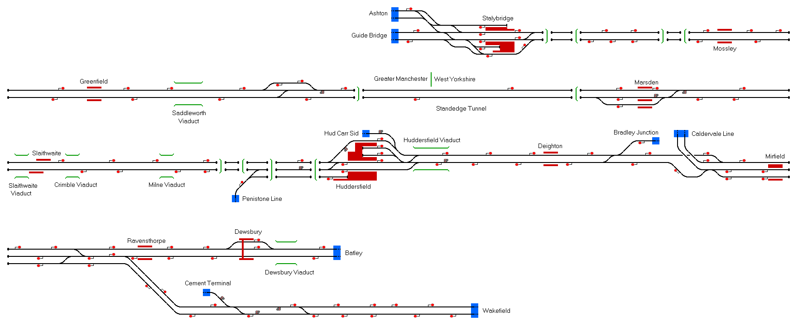

# Huddersfield
A route covering Huddersfield and the Huddersfield Line between Stalybridge and Dewsbury.

## Current Status

| Stage         | Status        |
| ------------- |:-------------:|
| Track Plan     | :heavy_check_mark: |
| Signalling      | :heavy_check_mark:      |
| Naming | :heavy_check_mark:      |
| Speed Limits | :heavy_check_mark: |
| Distances | :heavy_check_mark: |
| Timetable | :x: |
| Documentation | :x: |

## Data Sources

- [OpenStreetMap](https://www.openstreetmap.org/#map=11/53.6047/-1.8031)
- [OpenRailwayMap](https://www.openrailwaymap.org/)
- ["Lime St to Huddersfield" by Don Coffey via YouTube](https://youtu.be/VHRfBhr-Szc)
- ["Huddersfield to Eccles" by Don Coffey via YouTube](https://youtu.be/EXDLJiKn8zU)
- ["Manchester Oxford Road to York" by Don Coffey via YouTube](https://youtu.be/NGmIZFoh2Go)
- ["Hull to Piccadilly 2020" by Don Coffey va YouTube](https://youtu.be/XPw028OBVC4)